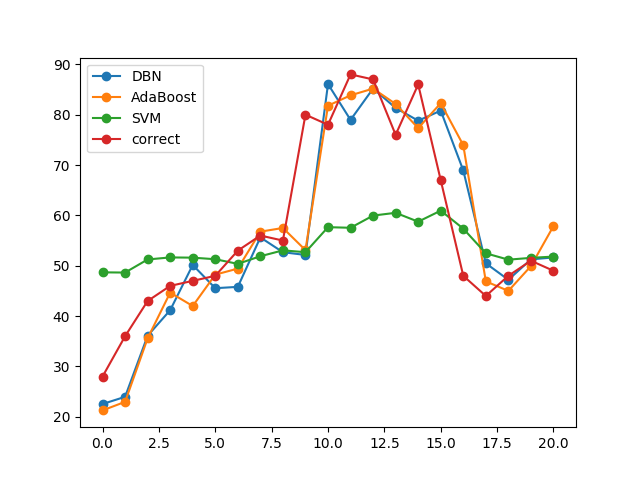

# air_pollution

step=1，不使用deep，使用cca的完整图，可以看出
预测的值跟前一个实际值强相关，应该是过拟合了。

step=1，不使用deep，使用cca，不使用PM2.5的历史数据的完整图，
可以看出去掉PM2.5历史数据之后，图像变得非常糟糕，
可以说用其他的数据可以学习出PM2.5的变化趋势，
但是具体的PM2.5的值，还是要靠PM2.5的历史数据才能推测出。

---

## 我是二级标题

### 我是三级

我是正文

我是第二段

1. 第一点
2. 第二点

* 啦啦
* 会更好

+ ff
+ jj

- gfdg
- hdfh

> 我是引用

`
I 
am 
code
`

