# air_pollution  
 
又做了一次不带deep限制的全部数据，MSE竟然变成72.39和86.17了。怀疑是波动，但仍需查明原因。  
 
去掉deep限制，MSE就变成91，98了。   
 
 
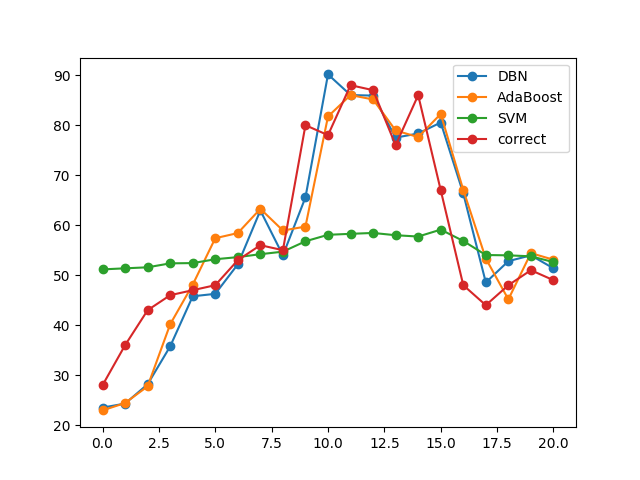   
这是去掉最不相关的的weather、wind做出来的图，
use_min_max_scaler = True
use_all_data = False
use_CCA_data = False
use_pm25_history = True
use_drop_least_importance = True
use_deep = False
step = 1
train_deep = 120
train_start = 121
predict_start = 122，MSE变为了73和87，比使用全部数据的要差一些。   
 
  
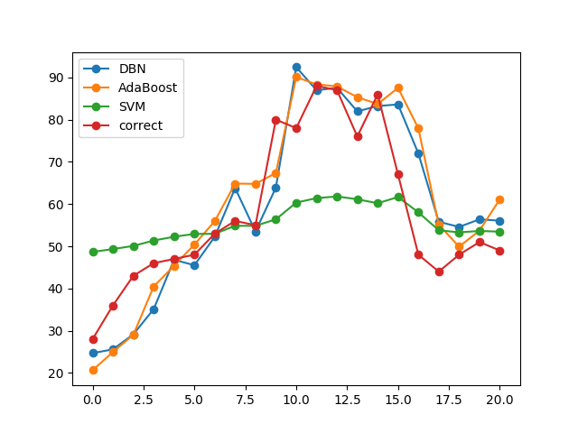   
这是使用cca算出来的最相关的pm10，co，temperature，moisture， pressure做出来的图，
use_min_max_scaler = True
use_all_data = False
use_CCA_data = True
use_pm25_history = True
use_deep = False
step = 1
train_deep = 120
train_start = 121
predict_start = 122，MSE变为了101和123，完全没有使用全部数据的好。  
 
 
  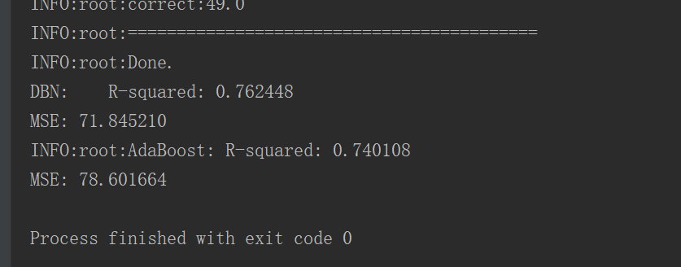   
这是使用全部数据做出来的图，
use_min_max_scaler = True
use_all_data = True
use_CCA_data = False
use_pm25_history = True
use_deep = False
step = 1
train_deep = 120
train_start = 121
predict_start = 122，貌似是现在最好的了。  
 
 
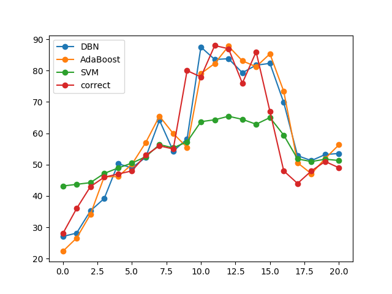  
ic/20180303_0.png) 这是使用randomforest算出来的最相关特征pm10和co做出来的图，
use_min_max_scaler = True
use_all_data = False  # have not completed
use_CCA_data = True
use_pm25_history = True
use_deep = False
step = 1
train_deep = 120
train_start = 121
predict_start = 122，看起来DBN效果比之前用temperature和moisture特征做的好，
待会再加入第三相关特征试试。 

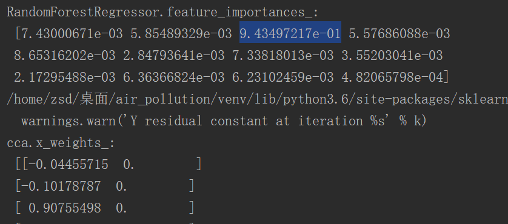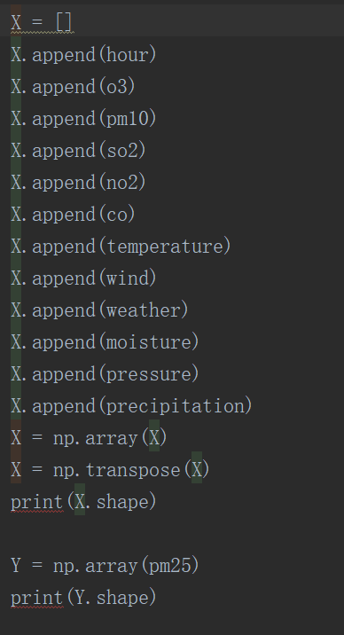  
可以看出与PM2.5最强相关的是pm10 
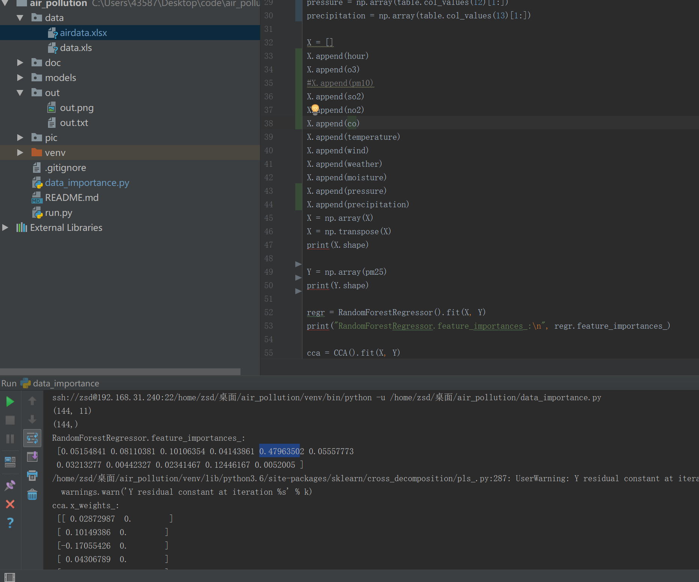  
与PM2.5次相关的是co 

 
 
---  
以下的是使用temperature和moisture特征的，
并不是最新的用全部数据算出的最相关特征
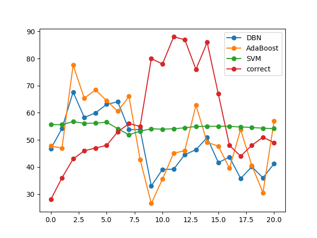  
~~use_min_max_scaler = True
use_all_data = False
use_CCA_data = True
use_pm25_history = False
use_deep = False
step = 1
train_deep = 120
train_start = 121
predict_start = 122的完整图，
可以看出去掉PM2.5历史数据之后，图像变得非常糟糕，
可以说用其他的数据可以学习出PM2.5的变化趋势，
但是具体的PM2.5的值，还是要靠PM2.5的历史数据才能推测出。~~ 

  
~~use_min_max_scaler = True
use_all_data = False
use_CCA_data = True
use_pm25_history = True
use_deep = False
step = 1
train_deep = 120
train_start = 121
predict_start = 122的完整图，可以看出
预测的值跟前一个实际值强相关，应该是过拟合了。~~ 

--- 

## 3月3日

### 工作概要

1. 700个数据，前400个数据为训练集，后500个数据作为测试集，并加入了一些气象特征，预测空气污染指数PM2.5，预测效果看起来
不错。avg_DBN(平均误差)=0.273 

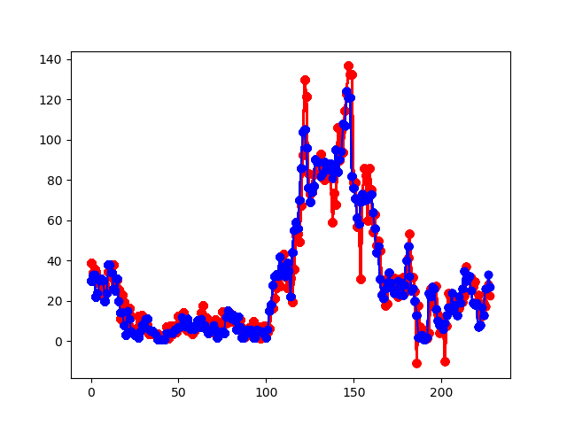   
2. 改成在线式的预测，每当读入新的数据就继续预测，边训练边预测，从第50个数据开始训练，第51个数据开始预测，预测步长step=1，每次训练都是拿最近的50组数据进行训练。avg_DBN(平均误差)=0.131

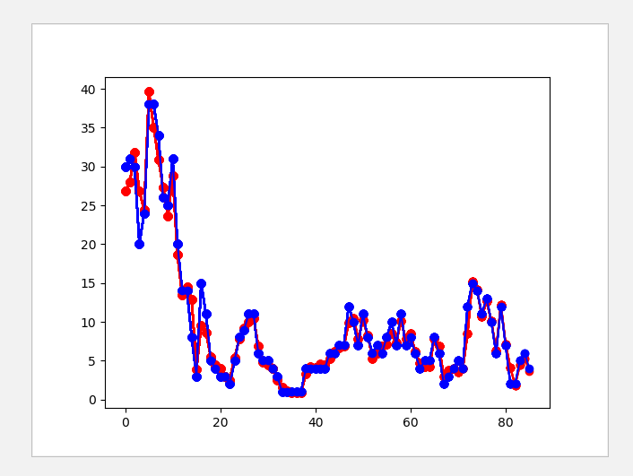  
3.  后来发现预测的时候训练和预测的顺序反了，相当于事先就将当前的数据样本包含最新的数据先训练了一遍，然后在去预测当前值，效果当然好啦。于是改变了顺序，第一张图是纠正之后的结果，发现avg_DBN(平均误差)=0.302。单独用Pm2.5预测，得到第一幅图，接着有把pm2.5从数据集中剔除掉，只留下现在训练集中只留下气象特征，预测Pm2.5，得到第二幅图，可以发现，这些气象数据与pm2.5相关度太低，考虑到数据集的准确度问题，于是决定换新数据集。

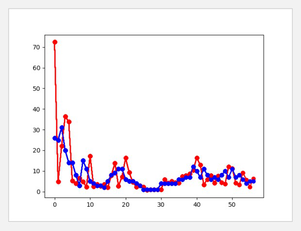  

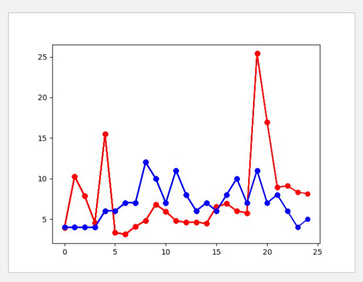  
4. 找到了新的空气和气象数据网站，能够收集每小时的数据。
空气质量数据网站：https://www.aqistudy.cn/
气象数据网站：http://data.cma.cn/data/detail/dataCode/A.0012.0001.html
云盘里有人每周更新全国各站点的每小时空气监测数据
https://pan.baidu.com/s/1gd8GUxt#list/path=%2F%E5%85%AC%E5%BC%80%2F%E5%85%A8%E5%9B%BD%E7%A9%BA%E6%B0%94%E8%B4%A8%E9%87%8F&parentPath=%2F%E5%85%AC%E5%BC%80
5.  在新的数据集里重新实验，从第50个数据开始训练，第51个数据开始预测，预测的步长是1。并用adaboost做对比，adaboost是一种迭代算法，其核心思想是针对同一个训练集训练不同的分类器(弱分类器)，然后把这些弱分类器集合起来，构成一个更强的最终分类器（强分类器），发现DBN的效果比原先旧的数据集效果要好了，但是比adaboost差一点。
use_min_max_scaler = True
use_all_data = True
step = 1
train_deep = 50
train_start = 50
predict_start = 51

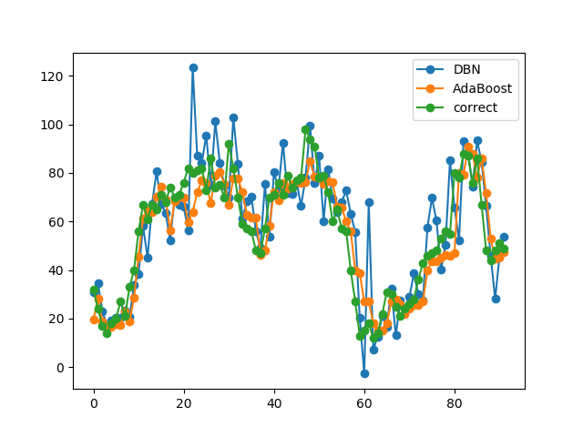  

_avg_DBN:0.247299   loss_avg_AdaBoost:0.182487
DBN:	R-squared: 0.615542
MSE: 211.726538
INFO:root:AdaBoost:	R-squared: 0.806699
MSE: 106.453403
6.  于是，就用dbn替换了adaboost中的弱分类器，加了svm对比，用sigmoid代替relu激活函数。因为一个非常大的梯度经过一个 ReLU 神经元，更新过参数之后，这个神经元再也不会对任何数据有激活现象了。如果这种情况发生，那么从此所有流过这个神经元的梯度将都变成 0 。也就是说，这个 ReLU 单元在训练中将不可逆转的死亡，导致了数据多样化的丢失。从图中可以发现，使用sigmoid函数之后dbn-adaboost预测的效果有了一点提高，而且dbn-adaboost的抖动较小。

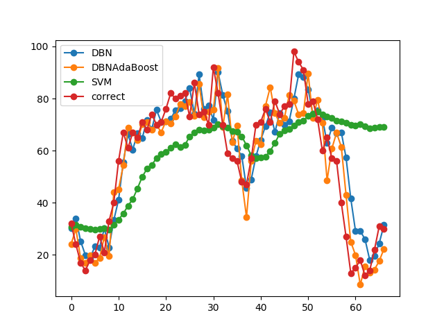  

use_min_max_scaler = True
use_all_data = True
step = 1
train_deep = 50
train_start = 50
predict_start = 51

l_avg_D:0.201764    l_avg_DA:0.177978   l_avg_S:0.589312
DBN:	R-squared: 0.810164
MSE: 104.545341
INFO:root:DBNAdaBoost:	R-squared: 0.794436
MSE: 113.207110

将DBN-AdaBoost与AdaBoost对比发现他们的预测效果很接近，但是比单纯的DBN准确率要高。

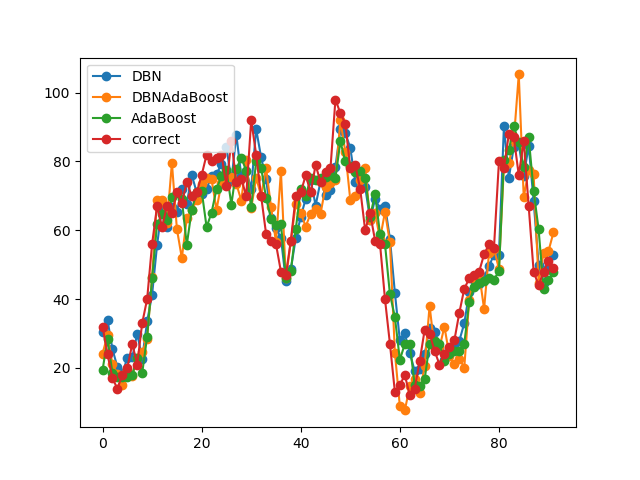  

参数设置

use_min_max_scaler = True
use_all_data = True
step = 1
train_deep = 50
train_start = 50
predict_start = 51

平均误差

l_avg_D:0.201259    l_avg_DA:0.188396  l_avg_A:0.185118
DBN:	R-squared: 0.810932
MSE: 104.122564
INFO:root:DBNAdaBoost:	R-squared: 0.759444
MSE: 132.477562
INFO:root:AdaBoost:	R-squared: 0.808426
MSE: 105.502396
7.  使用CCA和randomforest（随机森林）对PM2.5与温度（temperature）、风力 （wind）、 天气（weather）、湿度（ moisture）作相关度分析，发现温度和湿度的相关相关性更大，于是就将保留温湿度特征的数据在算法中实现。
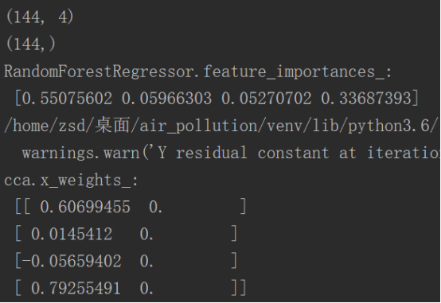  

将预测深度deep调到了120，DBN效果最好，DBN-AdaBoost的准确率也提高了。

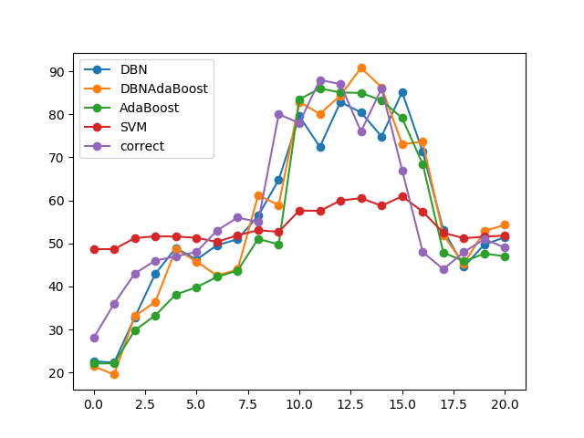  

参数设置

use_min_max_scaler = True
use_all_data = False
use_CCA_data = True
use_deep = False
step = 1
train_deep = 120
train_start = 121
predict_start = 122

平均误差

l_avg_D:0.138578    l_avg_DA:0.160282  l_avg_A:0.167904   l_avg_S:0.196340
DBN:	R-squared: 0.666527
MSE: 100.855421
INFO:root:DBNAdaBoost:	R-squared: 0.629013
MSE: 112.201321
INFO:root:AdaBoost:	R-squared: 0.585469
MSE: 125.370641
8.  考虑到PM2.5可能与其历史数据强相关，尝试将PM2.5从data里去掉，其它的气象特征能预测PM2.5的趋势，但结果不够准确，因此具体的PM2.5的值，还是要靠PM2.5的历史数据才能推测出。

  

于是就考虑pm2.5与PM10、CO、SO2等指标一起预测PM2.5。经过CCA和randomforst相关的分析得到PM10、CO与PM2.5强相关，所以可以放到data里进行预测，准确率比之前加气象参数的又提高了，虽然图像看起来不好拟合，但是可以考虑继续加相关的特征。

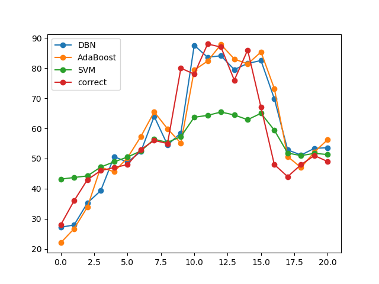  

use_min_max_scaler = True
use_all_data = False  # have not completed
use_CCA_data = True
use_pm25_history = True
use_deep = False
step = 1
train_deep = 120
train_start = 121
predict_start = 122

l_avg_D:0.119074    l_avg_A:0.133971   l_avg_S:0.138150
DBN:	R-squared: 0.733514
MSE: 80.596038
INFO:root:AdaBoost:	R-squared: 0.662733
MSE: 102.003027

用全部数据跑了一遍，是目前最准确的。

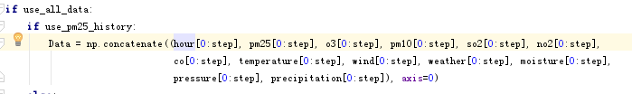  

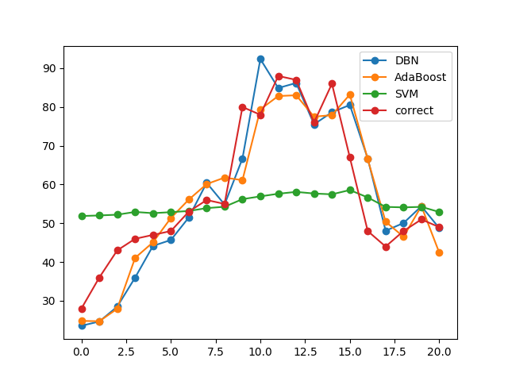  

use_min_max_scaler = True
use_all_data = True
use_CCA_data = False
use_pm25_history = True
use_deep = False
step = 1
train_deep = 120
train_start = 121
predict_start = 122

l_avg_D:0.120663	l_avg_A:0.129982	l_avg_S:0.217349
DBN:	R-squared: 0.762488
MSE: 71.845210
INFO:root:AdaBoost:	R-squared: 0.740108
MSE: 78.601664

10. 用除了气象的全部的特征数据画了一张图，能够看到各类数据的变化趋势，方便以后做CCA的相关性分析。从图中可以发现，pm10、no2和PM2.5的确是强相关的。

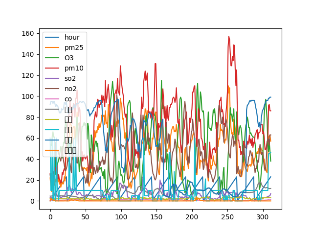  

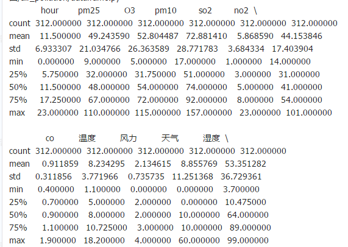  

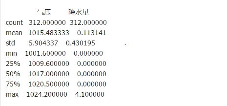  

11. 用312个数据出的图，用了三天时间。

  

use_min_max_scaler = True
use_all_data = True
use_CCA_data = False
use_pm25_history = True
use_drop_least_importance = False
use_deep = False
step = 1
'''train_deep = 120
train_start = 121
predict_start = 122'''
train_deep = 250
train_start = 251
predict_start = 252

l_avg_D:0.139119    l_avg_A:0.206861   l_avg_S:0.356926

0.82的R2

12.用tensorflow里的技巧来对dbn调参，分段调整了学习率，发现不收敛,还需继续调参

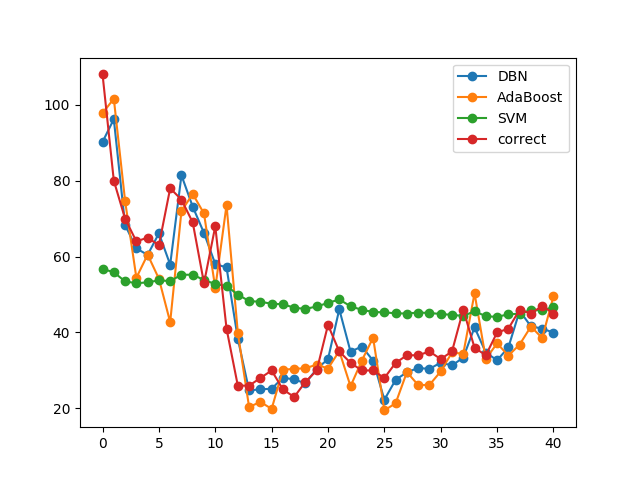  

use_min_max_scaler = True
use_all_data = True
use_CCA_data = False
use_pm25_history = True
use_drop_least_importance = False
use_deep = False
step = 1
'''train_deep = 120
train_start = 121
predict_start = 122'''
train_deep = 250
train_start = 251
predict_start = 252

l_avg_D:0.139119    l_avg_A:0.206861   l_avg_S:0.356926
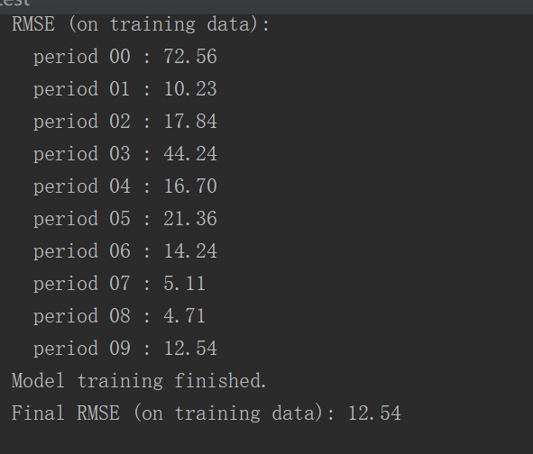  

13. https://colab.research.google.com/notebooks/mlcc/synthetic_features_and_outliers.ipynb?hl=zh-cn
访问需要翻墙，这个可以把离群的值删掉，可以提高正确率。
* 啦啦 

4.11

14. mytest.py做了多进程运行tensorflow，解决了多次运行后异常变慢的问题。
15. 调参，train_depp，train=10的时候就拟合了
ssh://zsd@192.168.31.240:22/home/zsd/桌面/air_pollution/venv/bin/python -u /home/zsd/桌面/air_pollution/mytest_2.py
Training model...
RMSE (on training data):
    i:   47.81594191782798     using seconds:   5
    i:   47.17126961688913     using seconds:   5
    i:   46.99601897446311     using seconds:   5
train_deep: 1   RMSE_avg: 47.32774350306007
    i:   40.120101707620954     using seconds:   5
    i:   40.034922546257775     using seconds:   5
    i:   41.712566864432695     using seconds:   5
train_deep: 2   RMSE_avg: 40.62253037277048
    i:   35.98261209879354     using seconds:   6
    i:   35.60171477920341     using seconds:   6
    i:   36.562348635729435     using seconds:   6
train_deep: 3   RMSE_avg: 36.04889183790879
    i:   30.455651746946348     using seconds:   7
    i:   31.414330932711742     using seconds:   7
    i:   29.64132604661265     using seconds:   7
train_deep: 4   RMSE_avg: 30.50376957542358
    i:   26.257555805438443     using seconds:   7
    i:   26.219237271767405     using seconds:   7
    i:   25.503204237005654     using seconds:   7
train_deep: 5   RMSE_avg: 25.9933324380705
    i:   24.314031374289733     using seconds:   8
    i:   24.421185356565744     using seconds:   8
    i:   23.168946442512315     using seconds:   8
train_deep: 6   RMSE_avg: 23.968054391122596
    i:   22.263611075016836     using seconds:   9
    i:   22.035477165457333     using seconds:   9
    i:   20.836277723167772     using seconds:   9
train_deep: 7   RMSE_avg: 21.711788654547316
    i:   21.16787104883965     using seconds:   10
    i:   20.959176246450472     using seconds:   10
    i:   20.44655609493384     using seconds:   10
train_deep: 8   RMSE_avg: 20.85786779674132
    i:   20.25247284435182     using seconds:   11
    i:   20.264593233771237     using seconds:   11
    i:   20.247449541202204     using seconds:   11
train_deep: 9   RMSE_avg: 20.25483853977509
    i:   20.263345468726826     using seconds:   12
    i:   20.267750723745987     using seconds:   11
    i:   20.256103052265594     using seconds:   11
train_deep: 10   RMSE_avg: 20.262399748246136
    i:   20.703004721926156     using seconds:   12
    i:   20.482359057561492     using seconds:   12
    i:   20.31160982683913     using seconds:   12
train_deep: 11   RMSE_avg: 20.498991202108925
    i:   20.299256348265203     using seconds:   13
    i:   20.47294818949193     using seconds:   13
    i:   20.51830454065888     using seconds:   13
train_deep: 12   RMSE_avg: 20.43016969280534
    i:   20.55411594222175     using seconds:   14
    i:   20.828331243946018     using seconds:   14
    i:   20.44778390819282     using seconds:   14
train_deep: 13   RMSE_avg: 20.610077031453528
    i:   21.055888206896594     using seconds:   15
    i:   20.815449825093342     using seconds:   15
    i:   20.493938141127078     using seconds:   15
train_deep: 14   RMSE_avg: 20.788425391039002
    i:   21.06115166627951     using seconds:   16
    i:   20.724454034834846     using seconds:   16
    i:   20.38994665861135     using seconds:   16
train_deep: 15   RMSE_avg: 20.72518411990857
    i:   20.77557660820656     using seconds:   17
    i:   20.630565084809827     using seconds:   17
    i:   20.427976124402562     using seconds:   17
train_deep: 16   RMSE_avg: 20.611372605806316
    i:   20.77358792344959     using seconds:   18
    i:   20.576499818853325     using seconds:   18
    i:   20.335229131442773     using seconds:   18
train_deep: 17   RMSE_avg: 20.561772291248563
    i:   20.64898620842552     using seconds:   19
    i:   20.466134905822088     using seconds:   19
    i:   20.382070349776097     using seconds:   19
train_deep: 18   RMSE_avg: 20.499063821341235
    i:   20.57250347374354     using seconds:   20
    i:   20.43361504084675     using seconds:   20
    i:   20.303632298737227     using seconds:   20
train_deep: 19   RMSE_avg: 20.436583604442507
    i:   20.661117040272792     using seconds:   21
    i:   20.35185690329263     using seconds:   21
    i:   20.257124867176014     using seconds:   21
train_deep: 20   RMSE_avg: 20.423366270247147
    i:   20.500466766715782     using seconds:   22
    i:   20.30194805471769     using seconds:   22
    i:   20.24805176810993     using seconds:   22
train_deep: 21   RMSE_avg: 20.3501555298478
    i:   20.378324735466432     using seconds:   23
    i:   20.27990331024026     using seconds:   23
    i:   20.265804537754754     using seconds:   23
train_deep: 22   RMSE_avg: 20.308010861153814
    i:   20.301247807203644     using seconds:   24
    i:   20.2666770765018     using seconds:   24
    i:   20.25099219634584     using seconds:   24
train_deep: 23   RMSE_avg: 20.272972360017096
    i:   20.33559596609681     using seconds:   25
    i:   20.2621804748032     using seconds:   25
    i:   20.254888084140234     using seconds:   25
train_deep: 24   RMSE_avg: 20.284221508346747
    i:   20.310307353166042     using seconds:   26
    i:   20.247742551551863     using seconds:   26
    i:   20.29676654745506     using seconds:   26
train_deep: 25   RMSE_avg: 20.28493881739099
    i:   20.253641498580993     using seconds:   27
    
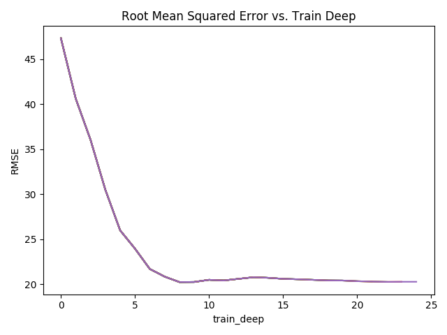  

16. 调整step，step=99的时候拟合了，完成了最佳step的搜寻
    
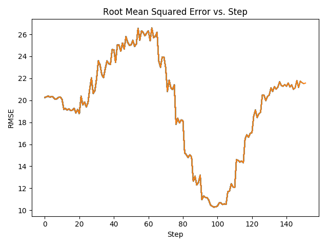  
Step中合并数据代码

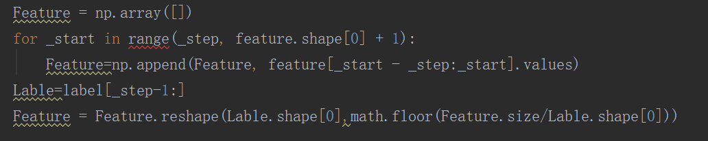
 
17. 用step=100,train_step=10,跑全部数据

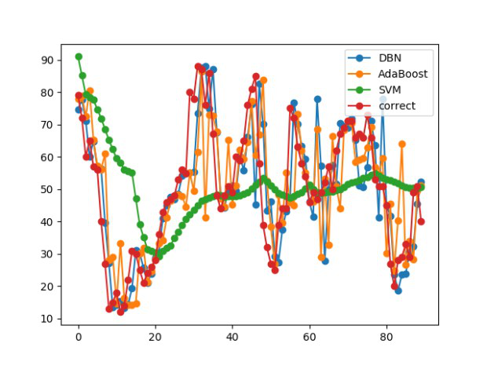 

> 我是引用 

`
I 
am 
code
`

